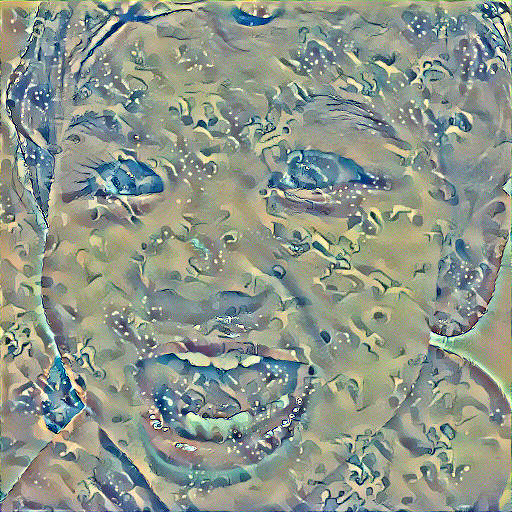

# 基于深度学习的图像风格转移

## PyTorch 代码实现

### 1. 内容差异的 loss 定义

```python
class Content_Loss(nn.Module):
    def __init__(self, target, weight):
        super(Content_Loss, self).__init__()
        self.weight = weight
        self.target = target.detach() * self.weight
        # 必须要用 detach 来分离出 target，这时候 target 不再是一个 Variable，这是为了动态计算梯度，否则 forward 会出错，不能向前传播
        self.criterion = nn.MSELoss()

    def forward(self, input):
        self.loss = self.criterion(input * self.weight, self.target)
        out = input.clone()
        return out

    def backward(self, retain_variabels=True):
        self.loss.backward(retain_variables=retain_variabels)
        return self.loss
```

- target: 内容图片
- weight: 内容权重
- input: 输入图片（目标图片/初始化图片）

### 2. 风格差异的 loss 定义

#### 2.1 Gram 矩阵的定义

```python
class Gram(nn.Module):
    def __init__(self):
        super(Gram, self).__init__()

    def forward(self, input):
        a, b, c, d = input.size()
        feature = input.view(a * b, c * d)
        gram = torch.mm(feature, feature.t())
        gram /= (a * b * c * d)
        return gram
```

#### 2.2. style loss 定义

```python
class Style_Loss(nn.Module):
    def __init__(self, target, weight):
        super(Style_Loss, self).__init__()
        self.weight = weight
        self.target = target.detach() * self.weight
        self.gram = Gram()
        self.criterion = nn.MSELoss()

    def forward(self, input):
        G = self.gram(input) * self.weight
        self.loss = self.criterion(G, self.target)
        out = input.clone()
        return out

    def backward(self, retain_variabels=True):
        self.loss.backward(retain_variables=retain_variabels)
        return self.loss
```

- target: 风格图片
- weight：风格权重
- input: 输入图片（目标图片/初始化图片）


### 3. 建立模型

使用19层的 vgg 作为提取特征的卷积网络，并且定义内容和风格特征层数。

```python
vgg = models.vgg19(pretrained=True).features
# vgg = vgg.cuda()

content_layers_default = ['conv_4']
style_layers_default = ['conv_1', 'conv_2', 'conv_3', 'conv_4', 'conv_5']


def get_style_model_and_loss(style_img,
                             content_img,
                             cnn=vgg,
                             style_weight=1000,
                             content_weight=1,
                             content_layers=content_layers_default,
                             style_layers=style_layers_default):

    content_loss_list = []
    style_loss_list = []

    model = nn.Sequential()
    # model = model.cuda()
    gram = loss.Gram()
    # gram = gram.cuda()

    i = 1
    for layer in cnn:
        if isinstance(layer, nn.Conv2d):
            name = 'conv_' + str(i)
            model.add_module(name, layer)

            if name in content_layers_default:
                target = model(content_img)
                content_loss = loss.Content_Loss(target, content_weight)
                model.add_module('content_loss_' + str(i), content_loss)
                content_loss_list.append(content_loss)

            if name in style_layers_default:
                target = model(style_img)
                target = gram(target)
                style_loss = loss.Style_Loss(target, style_weight)
                model.add_module('style_loss_' + str(i), style_loss)
                style_loss_list.append(style_loss)

            i += 1
        if isinstance(layer, nn.MaxPool2d):
            name = 'pool_' + str(i)
            model.add_module(name, layer)

        if isinstance(layer, nn.ReLU):
            name = 'relu' + str(i)
            model.add_module(name, layer)

    return model, style_loss_list, content_loss_list
```

### 4. 训练模型

```python
def get_input_param_optimier(input_img):
    """
    input_img is a Variable
    """
    input_param = nn.Parameter(input_img.data)
    optimizer = optim.LBFGS([input_param])
    return input_param, optimizer


def run_style_transfer(content_img, style_img, input_img, num_epoches=300):
    print('Building the style transfer model...')
    model, style_loss_list, content_loss_list = get_style_model_and_loss(
        style_img, content_img)
    input_param, optimizer = get_input_param_optimier(input_img)

    print('Opimizing...')
    epoch = [0]
    while epoch[0] < num_epoches:

        def closure():
            input_param.data.clamp_(0, 1)

            model(input_param)
            style_score = 0
            content_score = 0

            optimizer.zero_grad()
            for sl in style_loss_list:
                style_score += sl.backward()
            for cl in content_loss_list:
                content_score += cl.backward()

            epoch[0] += 1
            if epoch[0] % 50 == 0:
                print('run {}'.format(epoch))
                print('Style Loss: {:.4f} Content Loss: {:.4f}'.format(
                    style_score.data[0], content_score.data[0]))
                print()

            return style_score + content_score

        optimizer.step(closure)

        input_param.data.clamp_(0, 1)

    return input_param.data
```
注意：

- 这个模型里面参数不再是网络里面的参数，因为网络使用的是已经预训练好的 vgg 网络，这个算法里面的参数是合成图片里面的每个像素点。
- 我们可以将内容图片直接 copy 成合成图片，然后训练使得他的风格和我们的风格图片相似，同时也可以随机化一张图片作为合成图片，然后训练他使得他与内容图片以及风格图片具有相似性。

### 实验结果

- 训练过程(训练次数为 600 次)

```
run [50]
Style Loss: 2.6082 Content Loss: 5.7334

run [100]
Style Loss: 0.5668 Content Loss: 5.4259

run [150]
Style Loss: 0.4087 Content Loss: 5.1388

run [200]
Style Loss: 0.3185 Content Loss: 5.0379

run [250]
Style Loss: 0.2532 Content Loss: 4.9484

run [300]
Style Loss: 0.2143 Content Loss: 4.9017

run [350]
Style Loss: 0.1950 Content Loss: 4.8683

run [400]
Style Loss: 191.7546 Content Loss: 8.5052

run [450]
Style Loss: 2.8671 Content Loss: 7.3701

run [500]
Style Loss: 0.8463 Content Loss: 6.5618

run [550]
Style Loss: 0.4655 Content Loss: 6.0649

run [600]
Style Loss: 0.3302 Content Loss: 5.7489
```

- 内容图片


- 风格图片


- 输入图片


- 输出图片(内容与风格权重比为 1:1000)

